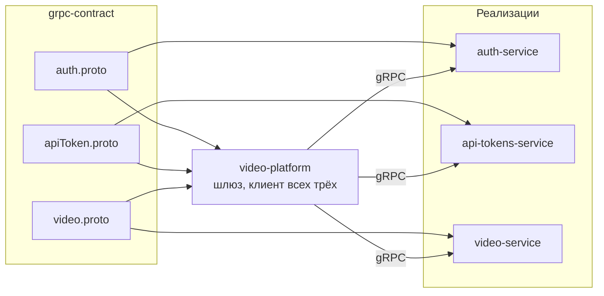

# grpc-contract

Контракты gRPC для системы видеохостинга. Репозиторий содержит только `.proto`
и сгенерированный из них Go-код — бизнес-логики здесь нет намеренно: контракт
должен быть отдельным пакетом, который зависимые сервисы подключают как
библиотеку.

## Контракты

| Пакет | Сервис | Реализация |
|---|---|---|
| `auth.proto` | `Auth` | [auth-service](https://github.com/nikaydo/auth-service) |
| `apiToken.proto` | `ApiToken` | [api-tokens-service](https://github.com/nikaydo/api-tokens-service) |
| `video.proto` | `Video` | [video-service](https://github.com/nikaydo/video-service) |

Потребитель — шлюз [video-platform](https://github.com/nikaydo/video-platform).



## Генерация

```bash
task install    # установить protoc-gen-go и protoc-gen-go-grpc
task generate   # перегенерировать код из .proto
```

Сгенерированный код лежит в `gen/<пакет>/` и коммитится. Так сервисы могут
подключать контракт как обычную зависимость, без protoc в образе сборки.

`task lint` перегенерирует код и падает, если результат отличается от
закоммиченного, — так расхождение между `.proto` и `gen/` обнаруживается на
ревью, а не при сборке сервиса.

## Совместимость контракта

gRPC-контракт обслуживает три сервиса одновременно, поэтому изменения
разделяются на совместимые и несовместимые.

**Совместимые** — можно выпускать независимо:

- добавление нового поля с новым номером;
- добавление нового метода в сервис;
- добавление нового RPC в существующий сервис (клиент его просто не вызывает);
- переименование поля через `reserved`: номер остаётся, проводной формат не меняется.

**Несовместимые** — требуют одновременного обновления всех сервисов:

- удаление или перенумерация поля;
- изменение типа существующего поля;
- изменение сигнатуры метода.

Пример из истории этого контракта: `Stream` был обычным методом, возвращающим
всё видео одним сообщением, и переведён в потоковый. Это несовместимое
изменение — его потребовалось раскатить вместе с `video-service` и шлюзом.

Правило: несовместимое изменение идёт одним коммитом, который меняет
`.proto`, сгенерированный код и всех потребителей сразу.

## Что было исправлено в контракте

| Проблема | Как исправлено |
|---|---|
| `go_package` указывал на несуществующие модули (`video-App-grpc`, `video-Service`), расходясь с фактическим импортом | Приведено в соответствие с `github.com/nikaydo/grpc-contract/gen/...` |
| `SignInResponse` не возвращал refresh-токен — клиент не мог обновить сессию | Добавлено поле `refresh_token` |
| `DeleteRequest` в API-токенах содержал только токен, без владельца | Добавлен обязательный `user_id` |
| `DeleteRequest` в видео содержал только `uuid` | Добавлен обязательный `user_id` |
| `Stream` возвращал всё видео одним сообщением | Переведён в потоковый `returns (stream StreamResponse)` |
| Имя сервиса `apiToken` в нижнем регистре | `ApiToken` |
| Поле `with_pass` не отражало смысл: пароль в ответе не возвращается никогда | `require_password` |
| Неиспользуемое `app_id` в `SignInRequest` | Помечено `reserved`, номер сохранён |